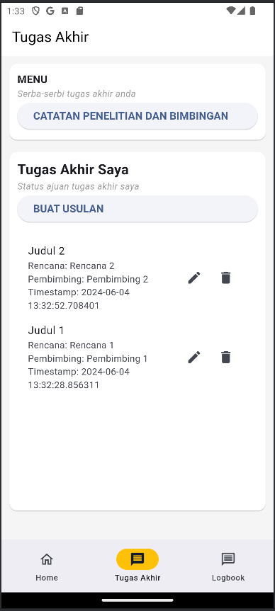
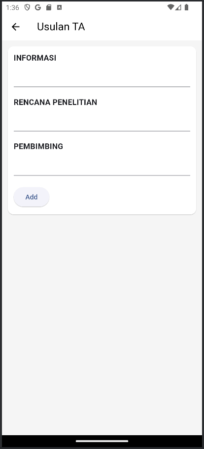

# LogProTa

## Deskripsi

Aplikasi Tracking Logbook Bimbingan Tugas Akhir

Dibuat oleh Kelompok 1:

| NRP        | Nama                    |
| ---------- | ----------------------- |
| 5025201008 | BARHAN AKMAL FALAHUDIN  |
| 5025211131 | Ali Hasyimi Assegaf     |
| 5025201271 | MUHAMMAD DAMAS ABHIRAMA |
| 5025201253 | MOHAMAD KHOLID BUGHOWI  |

## Tampilan

## Logbook bimbingan

Pengguna dapat menyimpan logbook bimbingan berisi komentar atau revisi yang diberikan oleh dosen pembimbing.

## Usulan Tugas Akhir

